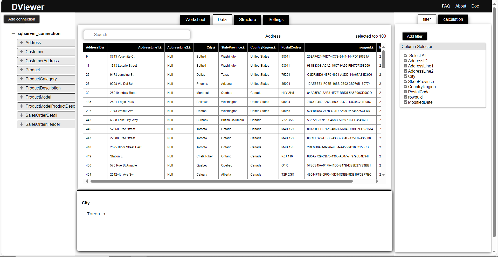

# **Data view**

Data can be view in table view from any sources.

<figure markdown="span">
  { width="1000" }
  <figcaption>Data tab</figcaption>
</figure>

## **View data in table**

- Expand the connection to view files/tables from source.
- Click on file/table name to view data in table view.
- Expand the file/table name to view columns.

## **Sort table data**

- Click on column header to sort data in ascending or descending order.

## **Filter table data**
### **Select columns to display**
Choose column to display from **column selector** on filter pane.

### **Filter by column value**
*Can filter data by column value using filter pane. Can add multiple filters.*

- Click on **_Add filter_** button on top right corner of table.

- Choose the column by drag and drop / by typing column name.

### **Search data**

*Can search data in table using search box.*

### **Highlighting data**

- Click on column header to highlight whole column.

- Click on cell to highlight single cell.See column value on result pane.

- Double click on cell to highlight entire row.

## **Custom calculations**

*Available soon.*

