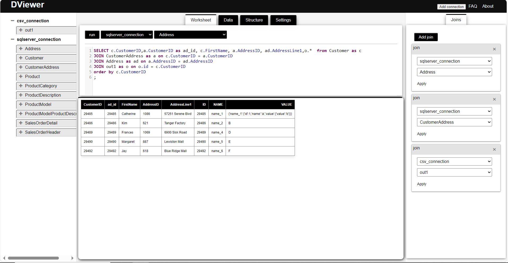

# **Worksheet**

*Can query and analyze data from various sources using SQL.*

<figure markdown="span">
  { width="1000" }
  <figcaption>Worksheet tab</figcaption>
</figure>

## **Query**

To query data from various sources using SQL, follow these steps:

1. Select **connection** and **file/table name** from the dropdown menu.
2. Enter the **query** in the editor.
3. Click on the **run** button to execute the query.
4. The results will be displayed in the **result** tab.

## **Add join**

*Can join two or more tables in a query.Can add multiple joins from different tables/sources.*

To add a join in a query, follow these steps:

1. Click on the **Add join** button on the top right corner of the editor.
2. Select **connection** and **file/table name** from the dropdown menu.

Download result table as xlsx file.
